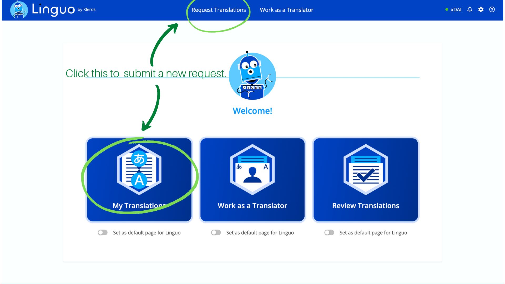
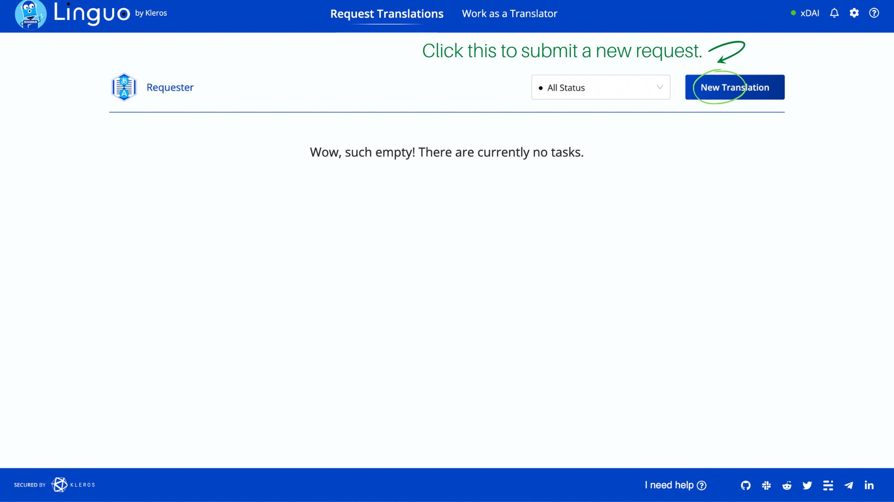
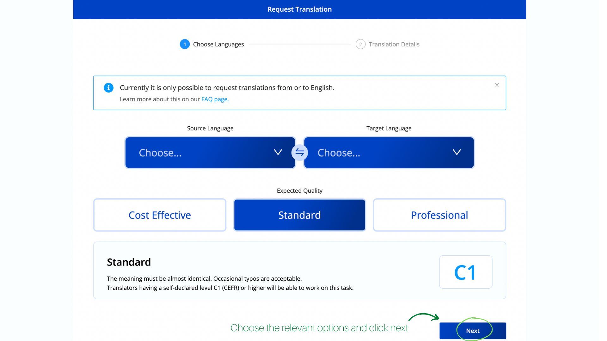
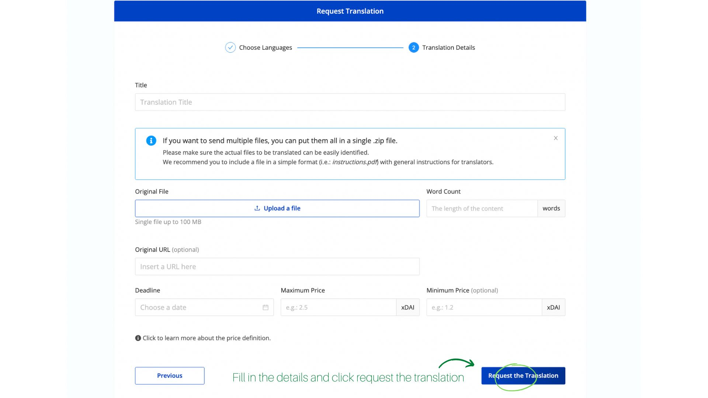
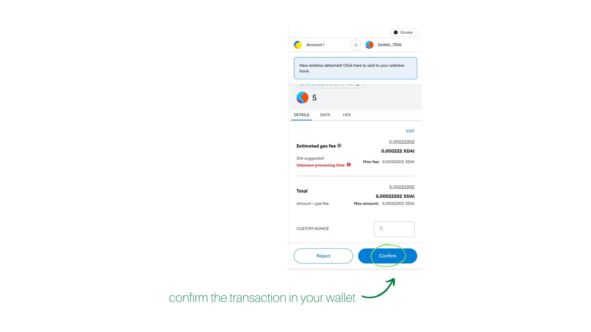
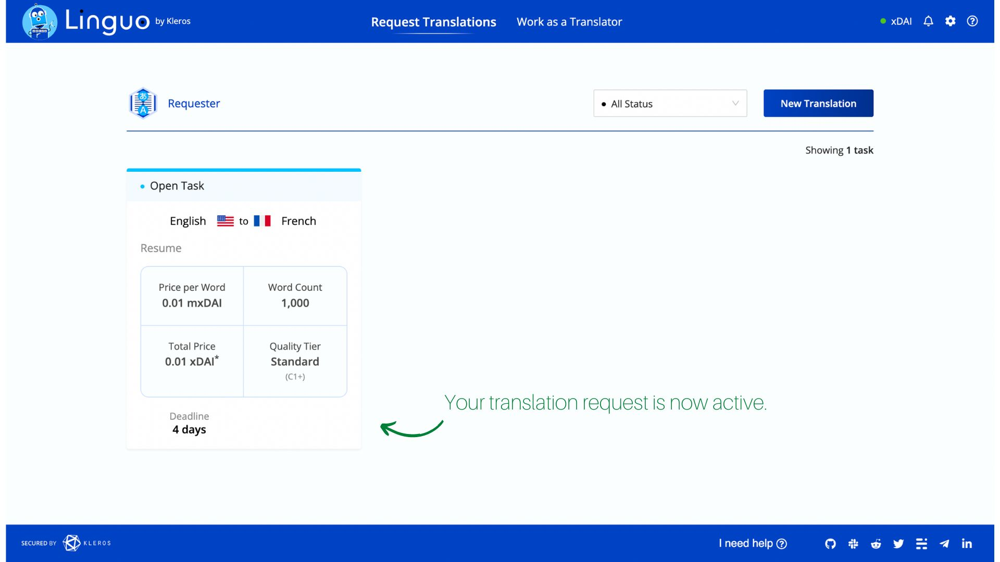
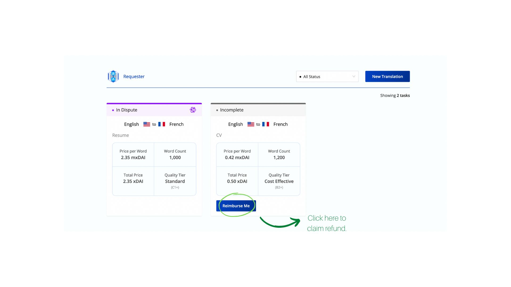
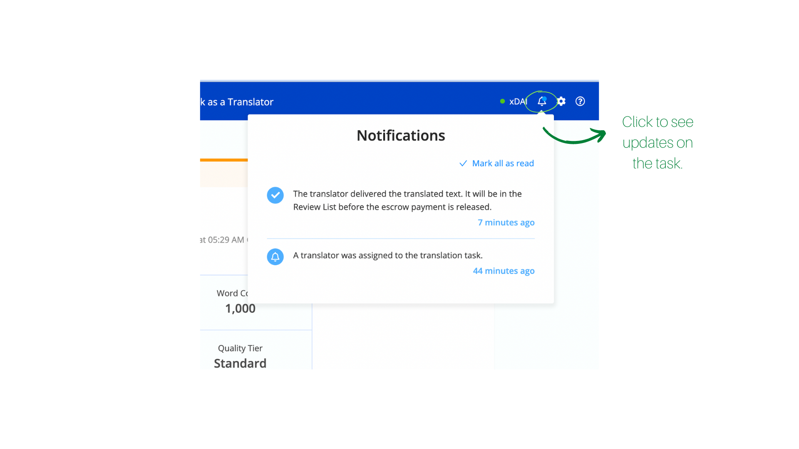

# Requesting translations

1\. Click on the My Translations option to see a list of ongoing translation requests that you have submitted.

2\. Click the new translation button to begin the submission.

3\. Fill out the form and click next to continue with the next step.


* Choose your source language (the language you want to translate) and your target language (the language you are translating to).&#x20;
* Choose the expected quality of the translation (make sure you choose carefully as this matches your request to a translator with the appropriate level of experience)


4\. Now input all the details of your request and click Request the translation.&#x20;


Ensure this form is filled out accurately to avoid disputes.



The pricing section is where it gets more interesting. Here, you will see three parameters: Deadline, MinPrice and MaxPrice.

The price rises linearly from the start date to the finish date offering an auction-like scenario for translators to decide their own personal acceptable price point for each piece of content.

For example, you can price your translation to be picked up quickly by opening with a high minimum price. Conversely, a broad spread between the minimum and maximum price set over a longer deadline (30 days, for example) gives a steadier price increase over time starting from a more reasonable entry point.

If you just want a fixed price translation with no price discovery, set both the Min and Max price to the same value. The pricing system. High initial prices will likely get your translation completed quicker.



5\. You will now be prompted with a transaction in your wallet. Please double-check the details and click confirm.

6\. Your request is now active! A translator should pick it up shortly.


**In case your request isn’t picked up on time, you can collect your deposit by clicking ‘Reimburse Me’.**

********


7\. You will be notified every time an update happens on your request. You can see them by clicking the notifications icon on the upper right-hand side.

8\. Once the translator submits the translation, it will be under review for 7 days. During this time you or any jurors can review it and create a dispute if the final result isn’t satisfactory or doesn’t meet your specified requirements!


If you want to dispute the translation you can do it as follows.

* To submit a challenge navigate to the request page, gather your evidence in a file and upload it by clicking the Evidence for Challenge button and confirm the transaction in your wallet.

\

* Once you’ve submitted the evidence and made the challenger deposit the case will be sent to the respective courts to be evaluated by the jurors.


